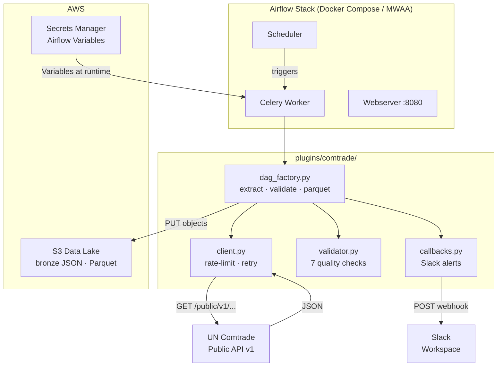
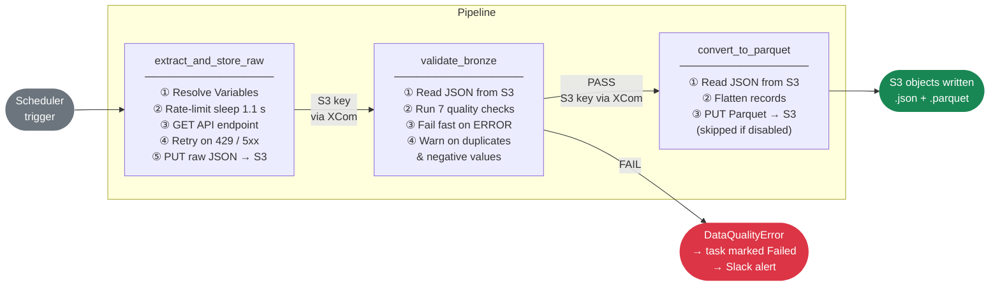
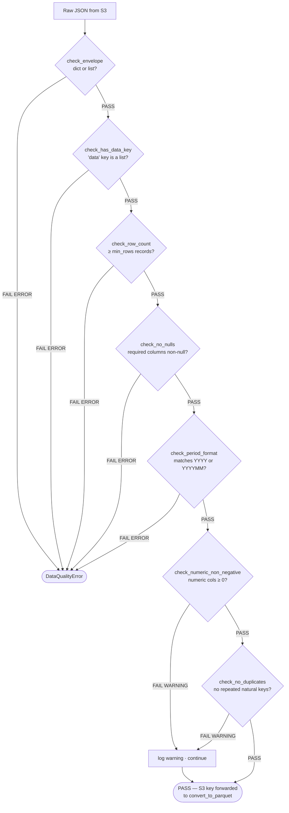
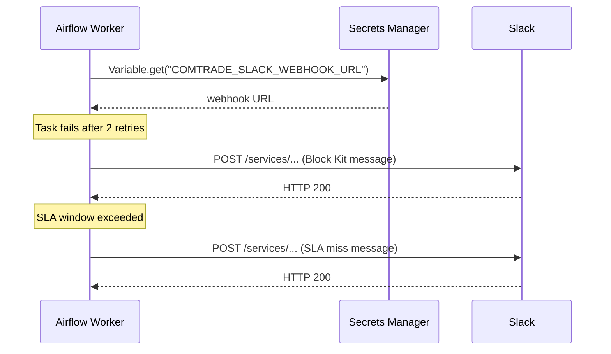
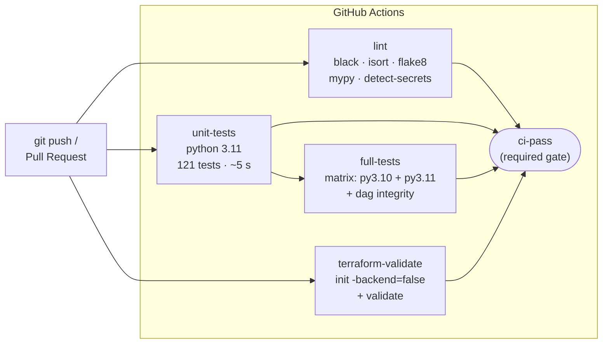

# global-trade-aws

> Production-grade Apache Airflow pipeline that extracts international trade data from the [UN Comtrade public API](https://comtradeapi.un.org) and lands it in AWS S3 as a Hive-partitioned data lake, with data quality validation, Slack alerting, SLA monitoring, and full IaC.

[](https://github.com/your-org/global-trade-aws/actions/workflows/ci.yml)


---

## Table of contents

- [Overview](#overview)
- [Architecture](#architecture)
- [Pipeline](#pipeline)
- [DAGs](#dags)
- [Project structure](#project-structure)
- [Quick start](#quick-start)
- [Makefile reference](#makefile-reference)
- [Configuration](#configuration)
- [Data quality](#data-quality)
- [Alerting & SLA monitoring](#alerting--sla-monitoring)
- [Testing](#testing)
- [CI / CD](#ci--cd)
- [Infrastructure (Terraform)](#infrastructure-terraform)
- [Documentation](#documentation)
- [Roadmap](ROADMAP.md)

---

## Overview

This project ingests data from all 8 publicly available UN Comtrade API v1 endpoints on a configurable schedule, validates the data quality of each response before it reaches storage, and writes the results to S3 in both raw JSON (bronze layer) and columnar Parquet formats.

**Key properties:**

| Property | Detail |
|----------|--------|
| Orchestrator | Apache Airflow 2.9.3 with CeleryExecutor |
| API | UN Comtrade Public API v1 (rate-limited, ~1 req/s) |
| Storage | AWS S3, Hive-partitioned (`type=X/freq=Y/year=YYYY/month=MM/`) |
| Data quality | 7-check suite on every API response before it is promoted |
| Alerting | Slack notifications on task failure and SLA miss |
| Secrets | AWS Secrets Manager (local dev: `LocalFilesystemBackend`) |
| IaC | Terraform (S3, IAM, Secrets Manager) |
| CI | GitHub Actions — lint → unit tests → full tests → terraform validate |

---

## Architecture



---

## Pipeline

Every DAG runs the same three-task sequence:



### S3 key layout

```
s3://<COMTRADE_S3_BUCKET>/
  comtrade/
    <endpoint>/
      type=<typeCode>/        ← omitted when endpoint has no typeCode
        freq=<freqCode>/      ← omitted when endpoint has no freqCode
          year=<YYYY>/
            month=<MM>/
              <run_id>.json                        ← always written
              fmt=parquet/
                <run_id>.parquet                   ← written when COMTRADE_WRITE_PARQUET=true
```

Partition directories use `key=value` notation — AWS Glue and Athena discover the schema without manual table configuration.

**Examples:**

```
comtrade/preview/type=C/freq=A/year=2024/month=03/scheduled__2024-03-01T00-00-00+00-00.json
comtrade/getMBS/series_type=T35/year=2024/month=03/scheduled__2024-03-01T00-00-00+00-00.json
comtrade/getComtradeReleases/year=2024/month=03/scheduled__2024-03-01T00-00-00+00-00.json
```

---

## DAGs

| DAG | Endpoint | Schedule | SLA | Task config |
|-----|----------|----------|-----|-------------|
| `comtrade_preview` | `/preview/{t}/{f}/{c}` | Monthly | 8 h | required: reporterCode, period · numeric: primaryValue |
| `comtrade_preview_tariffline` | `/previewTariffline/{t}/{f}/{c}` | Monthly | 8 h | dedup: reporterCode, partnerCode, cmdCode, flowCode, period, motCode |
| `comtrade_world_share` | `/getWorldShare/{t}/{f}` | Monthly | 8 h | required: reporterCode, period · numeric: share |
| `comtrade_metadata` | `/getMetadata/{t}/{f}/{c}` | Weekly | 4 h | no period check |
| `comtrade_mbs` | `/getMBS` | Monthly | 8 h | no period check (own period_type field) |
| `comtrade_da_tariffline` | `/getDATariffline/{t}/{f}/{c}` | Monthly | 8 h | required: reporterCode · numeric: primaryValue |
| `comtrade_da` | `/getDA/{t}/{f}/{c}` | Monthly | 8 h | required: reporterCode · numeric: primaryValue |
| `comtrade_releases` | `/getComtradeReleases` | Daily | 2 h | minimal checks |

> `t` = typeCode, `f` = freqCode, `c` = clCode

All DAGs share:
- `retries=2`, `retry_delay=5 min`
- `catchup=False`
- `on_failure_callback` on every task → Slack
- `sla_miss_callback` on the DAG → Slack

---

## Project structure

```
global-trade-aws/
│
├── dags/                            One DAG file per Comtrade endpoint
│   ├── comtrade_preview.py
│   ├── comtrade_preview_tariffline.py
│   ├── comtrade_world_share.py
│   ├── comtrade_metadata.py
│   ├── comtrade_mbs.py
│   ├── comtrade_da_tariffline.py
│   ├── comtrade_da.py
│   └── comtrade_releases.py
│
├── plugins/
│   └── comtrade/                    Auto-added to sys.path by Airflow
│       ├── __init__.py
│       ├── client.py                API calls · rate-limit · retry
│       ├── s3_writer.py             S3 upload helpers · key builder
│       ├── dag_factory.py           Shared @task factories (DRY across 8 DAGs)
│       ├── validator.py             Pure-Python quality checks (no Airflow dep)
│       └── callbacks.py             Slack failure & SLA miss notifications
│
├── tests/
│   ├── conftest.py                  sys.path + base fixtures
│   ├── unit/                        Fast; no Airflow required
│   │   ├── conftest.py
│   │   ├── test_client.py           24 tests
│   │   ├── test_s3_writer.py        13 tests
│   │   ├── test_dag_factory.py      20 tests (uses .function to bypass @task)
│   │   ├── test_validator.py        63 tests
│   │   └── test_callbacks.py        34 tests
│   └── dag_integrity/               DagBag-based structure tests
│       └── test_dag_integrity.py    Verifies all 8 DAGs import cleanly
│
├── terraform/                       IaC for AWS resources
│   ├── main.tf                      Provider + backend config
│   ├── s3.tf                        Data lake bucket
│   ├── iam.tf                       IAM user + policy
│   ├── secrets.tf                   Secrets Manager secrets
│   ├── variables.tf
│   ├── outputs.tf
│   └── environments/
│       ├── dev.tfvars
│       └── prod.tfvars
│
├── .github/
│   └── workflows/
│       └── ci.yml                   4-job CI pipeline
│
├── scripts/
│   └── bootstrap_secrets.sh         Push .env → Secrets Manager
│
├── config/
│   └── airflow_variables.json       Local dev Variable seed file
│
├── docker-compose.yml               Postgres · Redis · scheduler · worker · webserver · triggerer
├── Makefile                         Unified developer interface
├── pyproject.toml                   black · isort · mypy config
├── .pre-commit-config.yaml          black · isort · flake8 · mypy · detect-secrets · terraform fmt
├── requirements.txt
├── .env.example
└── ROADMAP.md
```

---

## Quick start

### Prerequisites

- **Docker Engine 24+** and **Docker Compose v2** (`docker compose version`)
- **AWS account** with an S3 bucket and credentials
- *(Production only)* **Terraform 1.5+** and **AWS CLI**

### 1. Clone and configure

```bash
git clone https://github.com/your-org/global-trade-aws.git
cd global-trade-aws

cp .env.example .env
```

Edit `.env` — set at minimum:

```dotenv
AWS_ACCESS_KEY_ID=AKIA...
AWS_SECRET_ACCESS_KEY=...
AWS_DEFAULT_REGION=us-east-1
COMTRADE_S3_BUCKET=my-data-lake-bucket

# Optional — enables Slack failure + SLA alerts
COMTRADE_SLACK_WEBHOOK_URL=https://hooks.slack.com/services/T.../B.../...
```

On Linux also run:

```bash
echo "AIRFLOW_UID=$(id -u)" >> .env
```

### 2. Install pre-commit hooks (recommended)

```bash
pip install pre-commit
pre-commit install
```

### 3. Start the stack

```bash
make up
```

Wait ~60 seconds for all containers to become healthy:

```bash
docker compose ps   # all should show "healthy"
```

Airflow UI → **http://localhost:8080** (`admin` / `admin`)

### 4. Seed Airflow Variables

```bash
make init-variables
```

### 5. Run the tests

```bash
make test           # unit tests only (fast, no Airflow needed)
make test-all       # full suite including dag integrity tests
```

### 6. Trigger a DAG

From the UI: unpause `comtrade_preview` → click **Trigger DAG**.

Or from the CLI:

```bash
docker compose exec airflow-webserver airflow dags trigger comtrade_preview
```

### 7. Verify data in S3

```bash
aws s3 ls s3://<your-bucket>/comtrade/preview/ --recursive | sort | tail -5
```

---

## Makefile reference

```
make up                  Start the full Docker Compose stack
make down                Stop the stack
make restart             down + up

make test                Run unit tests (no Airflow install needed)
make test-all            Run full suite (unit + dag integrity)
make lint                Run all pre-commit hooks on every file
make format              Run black + isort formatters

make init-variables      Import Airflow Variables from config/airflow_variables.json
make bootstrap-secrets   Push .env values to AWS Secrets Manager (after tf-apply)

make tf-init             terraform init
make tf-plan   ENV=dev   terraform plan  for the given environment
make tf-apply  ENV=dev   terraform apply for the given environment
make tf-destroy ENV=dev  terraform destroy (requires confirmation)
```

---

## Configuration

### Airflow Variables

All pipeline parameters are Airflow Variables read at task execution time (not DAG parse time). In production they are backed by AWS Secrets Manager at `airflow/variables/<NAME>`.

| Variable | Default | Description |
|----------|---------|-------------|
| `COMTRADE_S3_BUCKET` | **required** | Target S3 bucket name |
| `COMTRADE_TYPE_CODE` | `C` | Trade type — `C` commodities, `S` services |
| `COMTRADE_FREQ_CODE` | `A` | Frequency — `A` annual, `M` monthly |
| `COMTRADE_CL_CODE` | `HS` | Classification — `HS`, `SITC`, `BEC`, `EB02` |
| `COMTRADE_REPORTER_CODE` | _(all)_ | ISO numeric country code(s), comma-separated |
| `COMTRADE_PERIOD` | _(latest)_ | `2023` (annual) or `202301` (monthly) |
| `COMTRADE_PARTNER_CODE` | _(all)_ | Partner country code(s) |
| `COMTRADE_CMD_CODE` | _(all)_ | Commodity code(s) |
| `COMTRADE_FLOW_CODE` | _(all)_ | `X` export, `M` import, `re-X`, `re-M` |
| `COMTRADE_WRITE_PARQUET` | `false` | Set `true` to write Parquet alongside JSON |
| `COMTRADE_SLACK_WEBHOOK_URL` | _(empty)_ | Slack Incoming Webhook URL for alerts |
| `AWS_ACCESS_KEY_ID` | _(env)_ | AWS key (falls back to IAM role / `~/.aws`) |
| `AWS_SECRET_ACCESS_KEY` | _(env)_ | AWS secret |
| `AWS_DEFAULT_REGION` | `us-east-1` | AWS region |

### Secrets backend

| Environment | Backend | How to switch |
|-------------|---------|---------------|
| Local dev | `LocalFilesystemBackend` → `config/airflow_variables.json` | Default in `.env.example` |
| Production | `SecretsManagerBackend` | Uncomment `AIRFLOW_SECRETS_BACKEND*` in `.env` after `make tf-apply` |

---

## Data quality

The `validate_bronze` task runs between extract and Parquet conversion on every DAG run. It is implemented in `plugins/comtrade/validator.py` — a pure-Python module with no Airflow dependency.

### Check suite



| Check | Severity | Triggered by |
|-------|----------|-------------|
| `check_envelope` | ERROR | Response is not a dict or list |
| `check_has_data_key` | ERROR | Dict missing `data` key or it is not a list |
| `check_row_count` | ERROR | Fewer than `min_rows` records returned |
| `check_no_nulls` | ERROR | Null/empty value in a required column |
| `check_period_format` | ERROR | Period doesn't match `YYYY` or `YYYYMM` |
| `check_numeric_non_negative` | **WARNING** | Numeric column has a value < 0 |
| `check_no_duplicates` | **WARNING** | Repeated natural key combination |

ERROR failures raise `DataQualityError`, mark the task as failed, and trigger a Slack alert. WARNING failures are logged but the pipeline continues.

---

## Alerting & SLA monitoring



### Task failure alerts

Every task (`extract_and_store_raw`, `validate_bronze`, `convert_to_parquet`) has `on_failure_callback=task_failure_callback` set via the `dag_factory`. The Slack message includes:

- DAG ID and task ID
- Run ID and execution date
- Exception message (truncated to 400 chars)
- **View Task Logs** button linking directly to the Airflow log

### SLA miss alerts

Each DAG fires `sla_miss_callback` when it has not completed within its SLA window:

| Schedule | SLA window |
|----------|-----------|
| `@monthly` | 8 hours |
| `@weekly` | 4 hours |
| `@daily` | 2 hours |

### Setup

1. Create a Slack Incoming Webhook at <https://api.slack.com/messaging/webhooks>
2. Add to `.env`: `COMTRADE_SLACK_WEBHOOK_URL=https://hooks.slack.com/services/...`
3. In production: `make bootstrap-secrets ENV=prod`

If the variable is unset, callbacks log a warning and return silently — local development works without a Slack workspace.

---

## Testing

```
tests/
├── unit/                  No Airflow install required — always runs in CI
│   ├── test_client.py      24 tests — HTTP mocking, retry, rate-limit
│   ├── test_s3_writer.py   13 tests — moto mock_aws
│   ├── test_dag_factory.py 20 tests — .function attribute to bypass @task
│   ├── test_validator.py   63 tests — every check function, run_checks, assert_quality
│   └── test_callbacks.py   34 tests — payload structure, HTTP mocking, error isolation
└── dag_integrity/          Requires Airflow — runs in full-tests CI job
    └── test_dag_integrity.py
        ├── All 8 DAGs import without errors
        ├── Correct schedule, tags, catchup, description, retries
        ├── Exactly 3 tasks per DAG with correct task IDs
        └── Dependency chain: extract → validate → parquet
```

```bash
make test        # 121 unit tests  (~0.3 s)
make test-all    # + dag integrity (~30 s with Airflow installed)
```

Modules that depend on Airflow use `pytest.importorskip("airflow")` at the top — they skip gracefully when Airflow is not installed rather than failing.

---

## CI / CD



All four jobs must pass before a pull request can be merged. The `ci-pass` job acts as the single branch protection check.

---

## Infrastructure (Terraform)

```
terraform/
├── main.tf        Provider (~5.0) · backend config
├── s3.tf          Data lake bucket · versioning · lifecycle rules
├── iam.tf         IAM user · inline policy (s3:PutObject + s3:GetObject)
├── secrets.tf     Secrets Manager secrets for all Airflow Variables
├── variables.tf   environment · project_name · aws_region · …
├── outputs.tf     bucket_name · iam_user_arn · secret_arns
└── environments/
    ├── dev.tfvars
    └── prod.tfvars
```

```bash
make tf-plan  ENV=dev    # preview changes
make tf-apply ENV=dev    # apply (requires AWS credentials)
make bootstrap-secrets   # populate Secrets Manager from .env
```

### IAM policy (minimum required)

```json
{
  "Version": "2012-10-17",
  "Statement": [
    {
      "Effect": "Allow",
      "Action": ["s3:PutObject", "s3:GetObject"],
      "Resource": "arn:aws:s3:::<COMTRADE_S3_BUCKET>/comtrade/*"
    },
    {
      "Effect": "Allow",
      "Action": ["secretsmanager:GetSecretValue"],
      "Resource": "arn:aws:secretsmanager:<region>:<account>:secret:airflow/variables/*"
    }
  ]
}
```

---

## Documentation

| Document | Description |
|----------|-------------|
| [docs/architecture.md](docs/architecture.md) | System architecture, component responsibilities, infrastructure topology |
| [docs/data-flow.md](docs/data-flow.md) | End-to-end pipeline flow, S3 structure, XCom chain, retry/error table |
| [docs/api-reference.md](docs/api-reference.md) | All 8 Comtrade endpoints, parameters, and rate limits |
| [docs/configuration.md](docs/configuration.md) | All Airflow Variables and `.env` settings with scenario examples |
| [docs/plugins.md](docs/plugins.md) | Plugin internals — client, S3 writer, factory, validator, callbacks |
| [docs/operations.md](docs/operations.md) | Deployment, alerting setup, SLA monitoring, troubleshooting, IAM |
| [docs/testing.md](docs/testing.md) | Test suite structure, how to run, mocking strategy, CI integration |
| [ROADMAP.md](ROADMAP.md) | Completed milestones and upcoming work |
