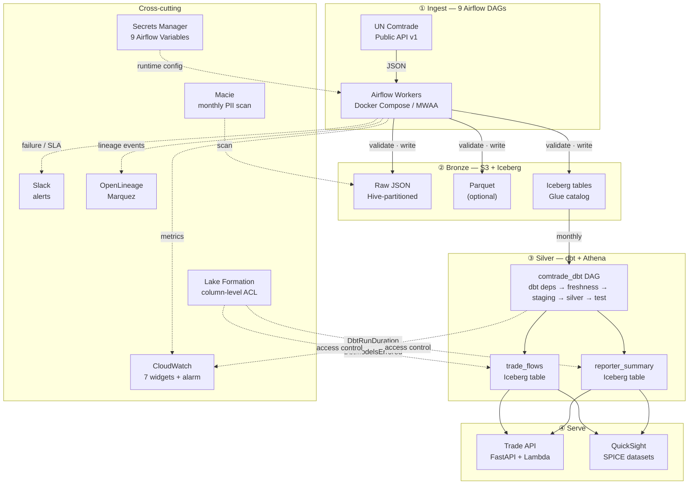
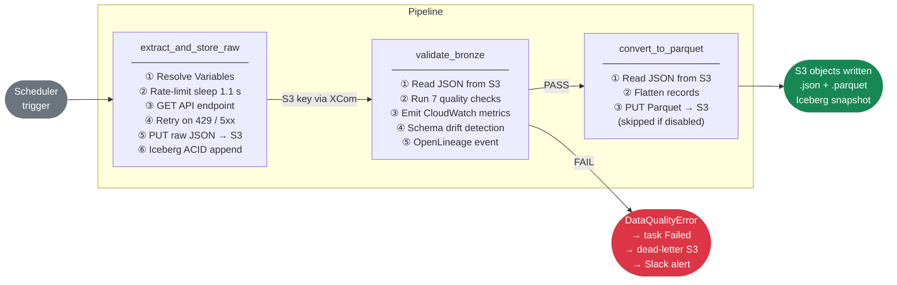
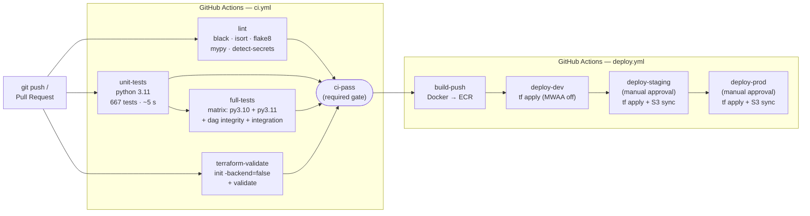

# global-trade-aws

> Production-grade ELT data platform that ingests international trade data from the [UN Comtrade public API](https://comtradeapi.un.org), lands it in an Apache Iceberg data lake on AWS S3, transforms it into queryable silver tables via dbt + Amazon Athena, and exposes it through a FastAPI trade API and Amazon QuickSight dashboards — all fully orchestrated by Apache Airflow and provisioned with Terraform.

[](https://github.com/lehcimhdz/global-trade-aws/actions/workflows/ci.yml)


---

## Table of contents

- [Overview](#overview)
- [Architecture](#architecture)
- [Pipeline](#pipeline)
- [DAGs](#dags)
- [Project structure](#project-structure)
- [Quick start](#quick-start)
- [Makefile reference](#makefile-reference)
- [Configuration](#configuration)
- [Data quality](#data-quality)
- [Alerting & SLA monitoring](#alerting--sla-monitoring)
- [Testing](#testing)
- [CI / CD](#ci--cd)
- [Infrastructure (Terraform)](#infrastructure-terraform)
- [Documentation](#documentation)
- [Roadmap](ROADMAP.md)

---

## Overview

> **Project status — portfolio showcase.** This repository is a fully-realized reference implementation. CI runs the full test and Terraform validation matrix on every push, but the infrastructure is intentionally not running against a live AWS account by default. The optional MWAA/QuickSight/Lambda components are gated behind Terraform variables so the stack can be brought up or torn down on demand without incurring standing AWS costs (estimated at ~$300/month minimum once MWAA is enabled).

This project implements a four-layer ELT data platform on AWS:

| Layer | Technology | What it produces |
|-------|-----------|-----------------|
| **① Ingest** | Airflow 2.9 + 9 DAGs | Raw JSON (bronze) + Parquet on S3 |
| **② Bronze** | PyIceberg + AWS Glue | ACID Iceberg tables with schema evolution |
| **③ Silver** | dbt-athena + Amazon Athena | `trade_flows` and `reporter_summary` Iceberg tables |
| **④ Serve** | FastAPI on Lambda + QuickSight | REST API + SPICE BI dashboards |

**Key properties:**

| Property | Detail |
|----------|--------|
| Orchestrator | Apache Airflow 2.9.3 with CeleryExecutor (dev: Docker Compose · prod: AWS MWAA) |
| API source | UN Comtrade Public API v1 — 8 endpoints, rate-limited (~1 req/s) |
| Bronze storage | AWS S3, Hive-partitioned + Apache Iceberg ACID tables (AWS Glue catalog) |
| Transformation | dbt-athena-community 1.8.4 — staging views + silver Iceberg tables |
| Query engine | Amazon Athena (dedicated workgroup, 10 GB scan limit, 5 named queries) |
| Data serving | FastAPI Lambda Function URL · QuickSight SPICE datasets |
| Data quality | 7-check suite on every API response; schema drift detection |
| Observability | CloudWatch dashboard (7 widgets) + Athena cost alarm + OpenLineage |
| Alerting | Slack on task failure and SLA miss; dbt error metrics to CloudWatch |
| Secrets | AWS Secrets Manager (local dev: `LocalFilesystemBackend`) |
| Security | Lake Formation column-level access; Amazon Macie monthly PII scan |
| IaC | Terraform — 16 `.tf` files covering all AWS resources |
| CI | GitHub Actions — lint → unit tests → full tests → terraform validate |
| Tests | 667 unit tests · 37 skipped (DAG tests skipped without Airflow) · zero Airflow mocks for business logic |

---

## Architecture



---

## Pipeline

### Ingestion (bronze) — 8 endpoint DAGs

Every ingestion DAG runs the same three-task sequence:



### Transformation (silver) — `comtrade_dbt`

Runs monthly after the ingestion window closes. Transforms Iceberg bronze tables into silver via dbt + Athena, and emits three CloudWatch metrics (`DbtRunDuration`, `DbtModelsErrored`, `DbtTestsFailed`) for every phase.

```
dbt_deps → dbt_source_freshness → dbt_run_staging → dbt_run_silver → dbt_test
```

`dbt_source_freshness` blocks downstream runs when bronze data is older than 35 days, preventing stale data from reaching the silver layer.

### S3 key layout (bronze)

```
s3://<COMTRADE_S3_BUCKET>/
  comtrade/
    <endpoint>/
      type=<typeCode>/
        freq=<freqCode>/
          year=<YYYY>/
            month=<MM>/
              <run_id>.json                   ← always written
              fmt=parquet/<run_id>.parquet     ← when COMTRADE_WRITE_PARQUET=true
    iceberg/<endpoint>/                       ← Iceberg data files + metadata
  dbt/silver/                                 ← Silver Iceberg tables
  athena-results/                             ← Athena query results (30d lifecycle)
  errors/                                     ← Dead-letter manifests (90d lifecycle)
```

---

## DAGs

### Ingestion DAGs

| DAG | Endpoint | Schedule | SLA |
|-----|----------|----------|-----|
| `comtrade_preview` | `/preview/{t}/{f}/{c}` | Monthly | 8 h |
| `comtrade_preview_tariffline` | `/previewTariffline/{t}/{f}/{c}` | Monthly | 8 h |
| `comtrade_world_share` | `/getWorldShare/{t}/{f}` | Monthly | 8 h |
| `comtrade_metadata` | `/getMetadata/{t}/{f}/{c}` | Weekly | 4 h |
| `comtrade_mbs` | `/getMBS` | Monthly | 8 h |
| `comtrade_da_tariffline` | `/getDATariffline/{t}/{f}/{c}` | Monthly | 8 h |
| `comtrade_da` | `/getDA/{t}/{f}/{c}` | Monthly | 8 h |
| `comtrade_releases` | `/getComtradeReleases` | Daily | 2 h |

> `t` = typeCode · `f` = freqCode · `c` = clCode

### Transformation & utility DAGs

| DAG | Schedule | Tasks | Purpose |
|-----|----------|-------|---------|
| `comtrade_dbt` | Monthly | 5 | Silver layer — dbt deps → freshness → staging → silver → test |
| `comtrade_backfill` | Manual (`schedule=None`) | 2 | Historical backfill — supports `preview`, `previewTariffline`, `getMBS` |

All DAGs share: `catchup=False`, `on_failure_callback` on every task (Slack), `sla_miss_callback` on the DAG (Slack). Ingestion DAGs use `retries=2`, `retry_delay=5 min` (more aggressive — the public Comtrade API has periodic 5xx blips). `comtrade_dbt` and `comtrade_backfill` use `retries=1`, `retry_delay=10 min`.

---

## Project structure

```
global-trade-aws/
│
├── api/                             FastAPI trade API (Lambda deployment)
│   ├── main.py                      Routes: /health · /v1/reporters · /v1/reporters/{iso}/summary · /v1/trade-flows
│   └── athena.py                    Synchronous Athena query runner (start → poll → paginate)
│
├── dags/                            One DAG file per orchestration unit (10 total)
│   ├── comtrade_preview.py
│   ├── comtrade_preview_tariffline.py
│   ├── comtrade_world_share.py
│   ├── comtrade_metadata.py
│   ├── comtrade_mbs.py
│   ├── comtrade_da_tariffline.py
│   ├── comtrade_da.py
│   ├── comtrade_releases.py
│   ├── comtrade_dbt.py              Silver layer orchestration (PythonOperator + dbt metrics)
│   └── comtrade_backfill.py         Historical backfill (schedule=None)
│
├── dbt/                             dbt project for the silver layer
│   ├── dbt_project.yml
│   ├── profiles.yml                 dbt-athena-community (dev + prod targets)
│   ├── packages.yml
│   ├── models/
│   │   ├── staging/                 Iceberg-backed views (stg_preview, stg_mbs)
│   │   └── silver/                  Iceberg tables partitioned by period
│   │       ├── trade_flows.sql      Bilateral commodity-level aggregations
│   │       └── reporter_summary.sql Per-country export/import/balance totals
│   └── tests/
│       └── assert_no_negative_trade_value.sql
│
├── plugins/
│   └── comtrade/                    Auto-added to sys.path by Airflow
│       ├── client.py                HTTP calls · rate-limit · retry
│       ├── s3_writer.py             S3 upload helpers · key builder
│       ├── dag_factory.py           Shared @task factories (DRY across 8 ingestion DAGs)
│       ├── validator.py             Pure-Python quality checks (7-check suite)
│       ├── callbacks.py             Slack alerts · SLA miss · dead-letter S3 manifests
│       ├── metrics.py               CloudWatch metrics (ingestion validation + dbt runs)
│       ├── iceberg.py               PyIceberg writer — ACID appends, schema evolution
│       ├── lineage.py               OpenLineage event emission to Marquez
│       └── schema.py                Schema drift detection + S3 baseline tracking
│
├── tests/
│   ├── unit/                        667 tests — no Airflow required for business logic
│   │   ├── test_client.py
│   │   ├── test_s3_writer.py
│   │   ├── test_dag_factory.py
│   │   ├── test_validator.py
│   │   ├── test_callbacks.py
│   │   ├── test_metrics.py          Ingestion + dbt CloudWatch metrics (42 tests)
│   │   ├── test_iceberg.py
│   │   ├── test_lineage.py
│   │   ├── test_schema.py
│   │   ├── test_dbt_project.py
│   │   ├── test_backfill_dag.py     (Airflow-gated)
│   │   ├── test_api.py              FastAPI endpoints (89 tests)
│   │   ├── test_api_terraform.py
│   │   ├── test_athena_terraform.py
│   │   ├── test_quicksight_terraform.py
│   │   ├── test_cloudwatch_terraform.py  Dashboard + alarm
│   │   ├── test_lake_formation_terraform.py
│   │   └── test_macie_terraform.py
│   ├── dag_integrity/               DagBag structural tests (all 10 DAGs)
│   └── integration/                 Multi-component smoke tests (moto S3)
│
├── terraform/                       IaC — 16 files, all AWS resources
│   ├── main.tf                      Provider + optional S3 remote backend
│   ├── variables.tf                 All input variables with validation
│   ├── outputs.tf                   Post-apply URLs, ARNs, and next-steps checklist
│   ├── s3.tf                        Data lake bucket + 5 lifecycle rules
│   ├── iam.tf                       IAM roles + least-privilege policies
│   ├── glue.tf                      Glue Data Catalog database (comtrade)
│   ├── athena.tf                    Workgroup (10 GB limit) + 5 named queries
│   ├── cloudwatch.tf                Dashboard (7 widgets) + Athena cost alarm
│   ├── lake_formation.tf            Column-level access (Airflow · API · QuickSight)
│   ├── macie.tf                     Monthly PII scan + KMS findings export
│   ├── secrets.tf                   Secrets Manager (9 Airflow Variables)
│   ├── mwaa.tf                      Managed Airflow — staging/prod only
│   ├── ecr.tf                       Docker image registry (immutable tags)
│   ├── vpc.tf                       VPC + subnets + NAT Gateway (for MWAA)
│   ├── api.tf                       Lambda + Function URL (CORS-enabled)
│   └── quicksight.tf                SPICE datasets + Athena data source
│
├── .github/
│   └── workflows/
│       ├── ci.yml                   lint → unit → full → terraform validate
│       └── deploy.yml               ECR build → dev → staging → prod (gated)
│
├── scripts/
│   ├── bootstrap_secrets.sh         Push .env values → Secrets Manager
│   └── trigger_backfill.sh          Convenience wrapper for comtrade_backfill DAG
│
├── config/
│   └── airflow_variables.json       Local dev Variable seed file
│
├── docker-compose.yml               Postgres · Redis · scheduler · worker · webserver · triggerer
├── Dockerfile                       Custom image (apache/airflow:2.9.3-python3.11 + deps)
├── Makefile                         Unified developer interface (40+ targets)
├── pyproject.toml                   black · isort · mypy config
├── ROADMAP.md                       All 7 tiers — 100% complete
└── docs/                            Extended documentation (8 guides)
```

---

## Quick start

### Prerequisites

- **Docker Engine 24+** and **Docker Compose v2** (`docker compose version`)
- **AWS account** with an S3 bucket and credentials (or an IAM role on EC2/ECS)
- *(Silver layer)* **Athena** enabled in the target region
- *(Production)* **Terraform 1.7+** and **AWS CLI**

### 1. Clone and configure

```bash
git clone https://github.com/lehcimhdz/global-trade-aws.git
cd global-trade-aws

cp .env.example .env
```

Edit `.env` — set at minimum:

```dotenv
AWS_ACCESS_KEY_ID=AKIA...
AWS_SECRET_ACCESS_KEY=...
AWS_DEFAULT_REGION=us-east-1
COMTRADE_S3_BUCKET=my-data-lake-bucket
```

On Linux also run:

```bash
echo "AIRFLOW_UID=$(id -u)" >> .env
```

### 2. Install pre-commit hooks (recommended)

```bash
pip install pre-commit
pre-commit install
```

### 3. Start the stack

```bash
make up
```

Wait ~60 seconds then verify: `docker compose ps` — all services should show `healthy`.

Airflow UI → **http://localhost:8080** (`admin` / `admin`)

### 4. Seed Airflow Variables

```bash
make import-vars
```

### 5. Run the tests

```bash
make test        # unit tests (no Airflow needed, ~1 s)
make test-full   # full suite including DAG integrity
```

### 6. Trigger an ingestion DAG

From the UI: unpause `comtrade_preview` → click **Trigger DAG**.

Or from the CLI:

```bash
make trigger DAG=comtrade_preview
```

### 7. Verify data in S3

```bash
aws s3 ls s3://<your-bucket>/comtrade/preview/ --recursive | sort | tail -5
```

### 8. Run the dbt silver layer

```bash
make dbt-full   # deps → run (staging + silver) → test
```

Or trigger the `comtrade_dbt` DAG in the UI for the full Airflow-orchestrated run.

### 9. Query the silver layer

```bash
# Via the named queries in Athena (provisioned by Terraform):
aws athena list-named-queries --work-group <name-prefix>-comtrade

# Via the trade API (after terraform apply with enable_api=true):
curl "<api-url>/v1/reporters?period=2022" | jq '.[:3]'
```

---

## Makefile reference

```
── Docker Compose ──────────────────────────────────────────────────
make up                  Start the full stack (background)
make down                Stop the stack (data preserved)
make down-volumes        Stop + delete all volumes (destructive)
make restart             down + up
make logs                Tail scheduler and worker logs

── Development ─────────────────────────────────────────────────────
make install             Install runtime dependencies
make install-dev         Install runtime + dev/test deps + pre-commit
make format              Run black + isort auto-formatters
make lint                Run black · isort · flake8 checks
make type-check          Run mypy on the plugin package
make check               lint + type-check

── Testing ─────────────────────────────────────────────────────────
make test                Unit tests (no Airflow required, ~1 s)
make test-full           Full suite: unit + DAG integrity + integration
make test-integration    Integration smoke tests only
make test-cov            Full suite with HTML coverage report
make test-api            Trade API unit tests only

── Airflow ─────────────────────────────────────────────────────────
make init                Initialise Airflow DB (run once before first up)
make import-vars         Import Variables from config/airflow_variables.json
make trigger DAG=<id>    Trigger a DAG run manually

── dbt ─────────────────────────────────────────────────────────────
make dbt-install         Install dbt + dbt-athena-community adapter
make dbt-deps            Install dbt packages
make dbt-run             Run all models (staging + silver)
make dbt-run-staging     Run staging views only
make dbt-run-silver      Run silver Iceberg tables only
make dbt-test            Run schema + custom tests
make dbt-full            deps → run → test (full pipeline)

── Terraform ───────────────────────────────────────────────────────
make tf-init             terraform init
make tf-plan   ENV=dev   Preview changes for environment
make tf-apply  ENV=dev   Apply changes (prompts for confirmation)
make tf-destroy ENV=dev  Destroy infrastructure (prompts for confirmation)
make tf-fmt              Auto-format Terraform files
make bootstrap-secrets   Push .env values → Secrets Manager (post-apply)

── API ─────────────────────────────────────────────────────────────
make api-build           Bundle api/ → build/api.zip (required before tf-apply)
make api-local           Run trade API locally (uvicorn)

── Backfill ────────────────────────────────────────────────────────
make backfill ENDPOINT=preview PERIODS=2020,2021,2022
```

---

## Configuration

### Airflow Variables

All pipeline parameters are Airflow Variables resolved at task runtime (not parse time). In production they are backed by AWS Secrets Manager at `airflow/variables/<NAME>`.

#### Core

| Variable | Default | Description |
|----------|---------|-------------|
| `COMTRADE_S3_BUCKET` | **required** | Target S3 bucket name |
| `COMTRADE_WRITE_PARQUET` | `false` | Set `"true"` to enable Parquet conversion |

#### Trade filters

| Variable | Default | Description |
|----------|---------|-------------|
| `COMTRADE_TYPE_CODE` | `C` | Trade type — `C` commodities, `S` services |
| `COMTRADE_FREQ_CODE` | `A` | Frequency — `A` annual, `M` monthly |
| `COMTRADE_CL_CODE` | `HS` | Classification — `HS`, `SITC`, `BEC`, `EB02` |
| `COMTRADE_REPORTER_CODE` | _(all)_ | ISO numeric country code(s), comma-separated |
| `COMTRADE_PERIOD` | _(latest)_ | `2023` (annual) or `202301` (monthly) |
| `COMTRADE_PARTNER_CODE` | _(all)_ | Partner country code(s) |
| `COMTRADE_CMD_CODE` | _(all)_ | Commodity code(s) |
| `COMTRADE_FLOW_CODE` | _(all)_ | `X` export, `M` import, `re-X`, `re-M` |

#### dbt

| Variable | Default | Description |
|----------|---------|-------------|
| `COMTRADE_DBT_DIR` | `/opt/airflow/dbt` | Absolute path to the dbt project inside the container |
| `COMTRADE_DBT_TARGET` | `prod` | dbt target profile — `dev` or `prod` |

#### AWS (can also be set via `.env`)

| Variable | Default | Description |
|----------|---------|-------------|
| `AWS_DEFAULT_REGION` | `us-east-1` | AWS region |
| `AWS_ACCESS_KEY_ID` | _(env)_ | Omit when using IAM roles |
| `AWS_SECRET_ACCESS_KEY` | _(env)_ | Omit when using IAM roles |

### Secrets backend

| Environment | Backend |
|-------------|---------|
| Local dev | `LocalFilesystemBackend` → `config/airflow_variables.json` |
| Production | `SecretsManagerBackend` — enabled by `make tf-apply && make bootstrap-secrets` |

---

## Data quality

The `validate_bronze` task runs after every extraction. Implemented in `plugins/comtrade/validator.py` — a pure-Python module with no Airflow dependency.

### Check suite

| Check | Severity | Triggered by |
|-------|----------|-------------|
| `check_envelope` | ERROR | Response is not a dict or list |
| `check_has_data_key` | ERROR | Dict missing `data` key or it is not a list |
| `check_row_count` | ERROR | Fewer than `min_rows` records returned |
| `check_no_nulls` | ERROR | Null/empty value in a required column |
| `check_period_format` | ERROR | Period doesn't match `YYYY` or `YYYYMM` |
| `check_numeric_non_negative` | **WARNING** | Numeric column has a value < 0 |
| `check_no_duplicates` | **WARNING** | Repeated natural key combination |

ERROR failures raise `DataQualityError`, fail the task, write a dead-letter manifest to `s3://.../comtrade/errors/` and trigger a Slack alert. WARNING failures are logged but the pipeline continues.

After validation, four CloudWatch metrics are emitted to `Comtrade/Pipeline` (dimensions: `DagId`, `Endpoint`): `RowCount`, `ChecksPassed`, `ChecksFailed`, `JsonBytesWritten`.

---

## Alerting & SLA monitoring

Slack alerts fire on every task failure and SLA miss. The same `COMTRADE_SLACK_WEBHOOK_URL` variable is used for both.

**Setup:** Create a Slack Incoming Webhook → add URL to `.env` or `make bootstrap-secrets ENV=prod`.

If the variable is unset, callbacks log a warning and return silently — local dev works without Slack.

### SLA windows

| Schedule | SLA |
|----------|-----|
| `@monthly` | 8 hours |
| `@weekly` | 4 hours |
| `@daily` | 2 hours |
| `comtrade_dbt` | 2 hours per task |

---

## Testing

```
tests/
├── unit/          667 tests — no Airflow install required for business logic
│   ├── test_client.py               HTTP client: URL construction, retry, rate-limit
│   ├── test_s3_writer.py            S3 key builder + upload helpers (moto)
│   ├── test_dag_factory.py          extract / validate / parquet task logic
│   ├── test_validator.py            All 7 checks, run_checks, assert_quality
│   ├── test_callbacks.py            Slack payloads, dead-letter, SLA miss
│   ├── test_metrics.py              Ingestion + dbt CloudWatch metrics (42 tests)
│   ├── test_iceberg.py              PyIceberg writer (sys.modules mock)
│   ├── test_lineage.py              OpenLineage event builder
│   ├── test_schema.py               Schema drift detection
│   ├── test_dbt_project.py          dbt YAML structure + SQL coverage (no dbt needed)
│   ├── test_backfill_dag.py         Backfill DAG structure (Airflow-gated)
│   ├── test_api.py                  FastAPI endpoints (89 tests)
│   ├── test_api_terraform.py        Lambda + Function URL TF config
│   ├── test_athena_terraform.py     Workgroup + 5 named queries TF config
│   ├── test_quicksight_terraform.py SPICE datasets TF config (76 tests)
│   ├── test_cloudwatch_terraform.py Dashboard + Athena alarm TF config
│   ├── test_lake_formation_terraform.py LF permissions TF config
│   └── test_macie_terraform.py      Macie scan TF config
├── dag_integrity/  DagBag tests — all 10 DAGs parse cleanly, correct structure
└── integration/    32 multi-component smoke tests against moto S3
```

```bash
make test        # unit tests only  (~1 s)
make test-full   # full suite       (~30 s with Airflow installed)
```

Tests that depend on Airflow skip automatically (`pytest.importorskip`) when Airflow is not installed. No business-logic module imports Airflow at module level.

---

## CI / CD



All four CI jobs must pass before a pull request can be merged. The `ci-pass` job acts as the single branch protection check. The deploy workflow is triggered on merges to `main` only.

---

## Infrastructure (Terraform)

All infrastructure is codified in `terraform/`. Variables control which optional components are enabled per environment.

```
terraform/
├── main.tf            Provider (aws ~5.0) + optional S3 remote backend
├── variables.tf       environment · project_name · aws_region · lifecycle days ·
│                      MWAA class/workers · QuickSight · API · Iceberg retention ·
│                      Athena alarm threshold
├── outputs.tf         bucket_name · dashboard_url · api_endpoint_url · …
│
├── s3.tf              Data lake bucket — versioning · SSE-S3 · public access block ·
│                      5 lifecycle rules (raw JSON → GLACIER_IR · Parquet → INTELLIGENT_TIERING ·
│                      errors 90d · athena-results 30d · Iceberg metadata)
├── iam.tf             airflow role/policy · airflow_dev user (dev only)
├── glue.tf            comtrade Glue database (Iceberg catalog)
├── athena.tf          comtrade workgroup (10 GB limit · CW metrics on) · 5 named queries
├── cloudwatch.tf      Dashboard (4 ingestion + 2 dbt + 1 errors widgets) · Athena alarm
├── lake_formation.tf  S3 data location · LF tags · column-level permissions per role
├── macie.tf           Macie session · KMS key · findings bucket · monthly job · filter
├── secrets.tf         9 Secrets Manager secrets for Airflow Variables
│
├── mwaa.tf            MWAA environment (enable_mwaa=true for staging/prod)
├── ecr.tf             Airflow image registry (immutable tags · scan on push)
├── vpc.tf             VPC · 2 public + 2 private subnets · NAT Gateway
├── api.tf             Lambda function + Function URL (enable_api=true)
└── quicksight.tf      Athena data source + 2 SPICE datasets (enable_quicksight=true)
```

```bash
make tf-plan  ENV=dev    # preview changes
make tf-apply ENV=dev    # apply (prompts for confirmation)
make bootstrap-secrets   # populate Secrets Manager from .env (post-apply)
```

### Optional components

| Feature | Variable | Default |
|---------|---------|---------|
| AWS MWAA (managed Airflow) | `enable_mwaa` | `false` |
| Trade API (Lambda) | `enable_api` | `false` |
| QuickSight dashboards | `enable_quicksight` | `false` |

### Key variables

| Variable | Default | Effect |
|----------|---------|--------|
| `data_lake_lifecycle_transition_days` | `90` | Days before raw JSON moves to GLACIER_IR |
| `iceberg_snapshot_retention_days` | `90` | Iceberg metadata noncurrent version expiry |
| `athena_bytes_scanned_alarm_gb` | `5` | CloudWatch alarm threshold (GB per 5 min) |

---

## Documentation

| Document | Description |
|----------|-------------|
| [docs/architecture.md](docs/architecture.md) | Full system architecture — all 4 layers, component responsibilities, technology stack |
| [docs/data-flow.md](docs/data-flow.md) | End-to-end data flow, S3 layout, XCom chain, retry/error table |
| [docs/dbt.md](docs/dbt.md) | dbt silver layer — models, tests, Athena adapter, freshness checks |
| [docs/api-reference.md](docs/api-reference.md) | All 8 Comtrade endpoints, parameters, and rate limits |
| [docs/configuration.md](docs/configuration.md) | All Airflow Variables and `.env` settings with scenario examples |
| [docs/plugins.md](docs/plugins.md) | Plugin internals — client, S3 writer, factory, validator, callbacks, metrics, Iceberg |
| [docs/operations.md](docs/operations.md) | Deployment, monitoring, alerting, troubleshooting, MWAA production setup |
| [docs/testing.md](docs/testing.md) | Test suite structure, mocking strategy, how to run, CI integration |
| [ROADMAP.md](ROADMAP.md) | All 7 tiers — 100% complete |
